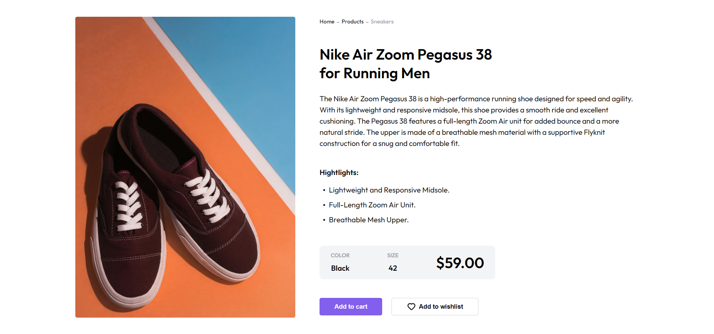

# Simple Product Page

Este proyecto es una página web que muestra una sección de producto, enfocada en la presentación de zapatillas deportivas con detalles y opciones de compra. Ofrece un diseño moderno y adaptable a diferentes tamaños de pantalla.

## Vista Previa



Puedes ver la versión demo en vivo aquí: [Simple Product Page](https://ibrahim-003.github.io/Simple-Product-Page/)

## Características

- **Responsiva:** La página se adapta a diferentes tamaños de pantalla utilizando etiquetas `<picture>` y `srcset` para cargar imágenes adecuadas según el dispositivo.
- **Sección detallada del producto:** Muestra una descripción clara del producto, sus características, colores disponibles, y precio.
- **Acciones del producto:** Ofrece botones interactivos para agregar el producto al carrito o a la lista de deseos.
- **Estilo moderno:** Usa la fuente "Outfit" desde Google Fonts para un estilo limpio y profesional.

## Estructura de Archivos

```
|-- index.html              # Página principal
|-- assets/
    |-- css/
    |   |-- reset.css       # Reseteo de estilos predeterminados del navegador
    |   |-- styles.css      # Estilos personalizados de la página
    |-- images/
    |   |-- shoe_image.png      # Imagen de baja resolución del producto
    |   |-- shoe_image@2x.png   # Imagen de alta resolución del producto
    |   |-- heart.svg           # Icono de corazón para el botón de lista de deseos
    |   |-- devchallenges-logo.svg # Favicon de la página
```

## Instalación

1. Clona este repositorio en tu máquina local:
   ```bash
   git clone https://github.com/tu-usuario/Simple-Product-Page.git
   ```
2. Asegúrate de tener conexión a Internet para cargar las fuentes de Google Fonts y los estilos CSS.
3. Abre `index.html` en tu navegador para ver la página.

## Uso

Puedes personalizar esta página modificando los estilos en el archivo `styles.css` o ajustando el contenido en `index.html`. Cambia las imágenes, ajusta los textos o añade más productos según sea necesario.

## Tecnologías Utilizadas

- HTML5
- CSS3
- Google Fonts

## Autor

Este proyecto fue creado por [Ibrahim Almeyda].
